# Component Selection
--------------
## Table of Contents
- [Voltage Regulator](#voltage-regulator)
- [UV Light Sensor](#uv-light-sensor)
- [Humidity Sensor](#humidity-sensor)
- [Motor Driver](motor-driver)
- [Temperature Sensor](temperature-sensor)
- [Motor](motor)
- [OpAmp](opamp)
--------------
## Voltage Regulator

| Option 1 | Pros          | Cons          |
| -------- | ------------- | ------------- |
| 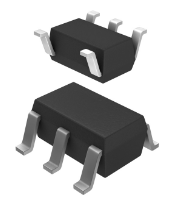 | - Relatively cheap compared to other 3.3V regulators.    | - Maximum Vin is 6V (5.5V recommended); the input of our power budget. No extra room.     |
| SC189ZSKTRT - IC REG BUCK 3.3V 1.5A $1.20/ea Link | - Small footprint on PCB so it is easier to fit with other components into smaller space.     | - Adjustable output voltage only goes from 1 to 3.3V so most of the range does not work for this project.  |
| [Link](https://www.digikey.com/en/products/detail/semtech-corporation/SC189ZSKTRT/2182360) | - Small footprint on PCB so it is easier to fit with other components into smaller space.     |    |

| Option 2 | Pros          | Cons          |
| -------- | ------------- | ------------- |
| 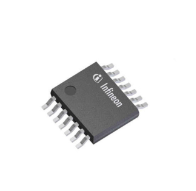 | - Higher voltage ceiling that can be stepped down.     | - Fixed output voltage which does not allow flexibility later on.     |
| TLS4120D0EPV33XUMA1 - Switching Regulator IC 3.3V 2A $4.95/ea | - Good switching frequency range using both Khz and Mhz ranges. Better on/off control.    | - Very large; utilizes more space and pads.    |
| [Link](https://www.digikey.com/en/products/detail/infineon-technologies/TLS4120D0EPV33XUMA1/12756107) |       |        |

| Option 3 | Pros          | Cons          |
| -------- | ------------- | ------------- |
| 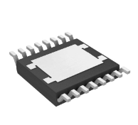 | - Output voltage is adjustable from 3.3V to 20V in case the power rail needs editing later on.     | - Output current is limited to 500mA maximum with a 380mA recommended.    |
| LT3433EFE#TRPBF - IC REG BCK BST ADJ 500MA $9.54/ea | - Capable of both stepping-up and stepping-down the input voltage.     | - Far more expensive than most other 3.3V capable regulators.    |
| [Link](https://www.digikey.com/en/products/detail/analog-devices-inc/LT3433EFE-TRPBF/959580) |       |        |
--------------
Choice: Option 2
-
Rationale: The second option provides a higher ceiling on the input voltage we can deliver if needed. While the fixed output voltage is not ideal, our current aim of 3.3V should be good to carry through the rest of the project for power needs. This also takes into account the max output current being the highest of the three at 2A. The cost is around the median for 3.3V regulators. The third option is great, but the cost just seems far too high with a low maximum current.

--------------
## UV Light Sensor

| Option 1 | Pros          | Cons          |
| -------- | ------------- | ------------- |
| 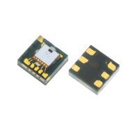 | - Senses specifically UV light, eliminating the chances of other light waves interfering with the signal.      | - A 2mm x 2mm dimension will make it harder to install and make sure its working   |
| LTR-390UV-01 $0.62 | - Great price for our project.      | - Will make the piece hard to attach properly.    |
| [Link](https://www.digikey.com/en/products/detail/liteon/LTR-390UV-01/7322497) |     |      |

| Option 2 | Pros          | Cons          |
| -------- | ------------- | ------------- |
| 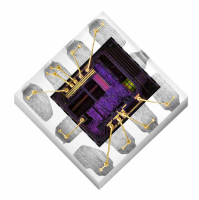 | - Surface mount which is necessary for our system design   | - Component takes a higher understanding of light sensors     |
| SI1132-A10-GM-ND $3.61 | - Mainly used for UV light which is what we want for our system     | - A 2mmx2mm dimension makes it harder for us to install and make sure it works properly     |
| [Link](https://www.digikey.com/en/products/detail/silicon-labs/SI1132-A10-GM/6195840) | - Given PCB outline makes it easier to understand how to install and get running    | -Also reads ambient light so that could effect our UV light readings    |

| Option 3 | Pros          | Cons          |
| -------- | ------------- | ------------- |
| 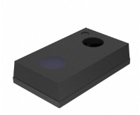 | - Has multifunctionlity adn is programmable for easier use     | - Higher cost than our usual light sensor     |
| SI1146-M01-GMR $4.43 | - Low power necessities     | - Has a limited range     |
| [Link](https://www.digikey.com/en/products/detail/silicon-labs/SI1146-M01-GMR/5271747) | - Works with our programs we want to use for our system     | - Needs calibration in orde to operate correctly     |
--------------
Choice: Option 3
-
Rationale: Initially option one seemed the best of the three. Featuring specifically UV light sensitivity, which is exactly what we need, as wella s a low unit price it seemed like a clear winner. Unfortunately (or rather fortunately) we noticed it needed to be bought at large bulk, putting it out of our price range despite its ideal specifications. The third choice, while having the highest unit price and being primarily an IR proximity sensor, it also features a UV index sensor that would work well with our project. Additionally, it is much easier to use and readily accessible for outdoor use than option 2 which optimized for indoor use by default. 

-----------------
## Humidity Sensor

| Option 1 | Pros          | Cons          |
| -------- | ------------- | ------------- |
| 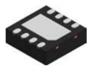 | - Very well documented data sheet      | - More expensive. Considering we will need to by multiple in case some get lost or damaged due to their small size     |
| HDC3022DEJR $5.61 | - Will be easy to find all necessary specifications     | - It could limit our budget    |
| [Link](https://www.digikey.com/en/products/detail/texas-instruments/HDC3022DEJR/17748469) |      |      |

| Option 2 | Pros          | Cons          |
| -------- | ------------- | ------------- |
| 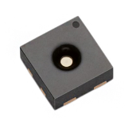 | - Cheaper than usual     | - A 2mmx2mm dimension makes it harder for us to install and make sure it works properly     |
| 1649-SHTC3-TR-10KSTR-ND $2.86 | - Surface mountable     | - Difficult to surface mount because of size of pins |
| [Link](https://www.digikey.com/en/products/detail/sensirion-ag/SHTC3-TR-10KS/9477851) | -  Can be used as both a temperature and  humidity sensor |    |

| Option 3 | Pros          | Cons          |
| -------- | ------------- | ------------- |
| 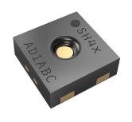 | - Simple to understand     | - A 2mmx2mm dimension makes it harder for us to install and make sure it works properly     |
| 1649-SHT45-AD1B-R2TR-ND $7.18 | - Only one output pin     | - More expensive. Considering we will need to by multiple in case some get lost or damaged due to their small size     |
| [Link](https://www.digikey.com/en/products/detail/sensirion-ag/SHT45-AD1B-R2/16360966) | - Given PCB build     | - Has a limited range     |
--------------
Choice: Option 3
-
Rationale: The humanity sensor "SHT45-AD1B-R2" has a high resolution of 0.01% RH and 0.01°C, and a low power consumption of 0.4 µW at 1 measurement per second. It also has a fast response time of less than 1 second, and a long-term stability of less than 0.25% RH per year. Compared to other sensors of the same size, the "SHT45-AD1B-R2" offers better performance, reliability, and flexibility for different use cases.

----------------------
## Motor Driver

| Option 1 | Pros          | Cons          |
| -------- | ------------- | ------------- |
| 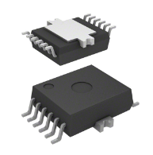 | - Logic inputs 3.3 V and 5.0 V TTL/CMOS-compatible  | - Complicated to use |
| IFX9201SGAUMA1 $3.79 | - Chopper current limitation  |  |
|  | - Short circuit shut down with latch behavior  |  |
|  | - Over Temperature shut down with latch behavior  |  |
|  | - VS undervoltage shutdown  |  |
| [Link](https://www.digikey.com/en/products/detail/infineon-technologies/IFX9201SGAUMA1/5415542) | - Open load detection in ON and OFF state |  |

| Option 2 | Pros          | Cons          |
| -------- | ------------- | ------------- |
| 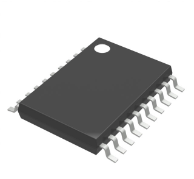 | - Abnormality Detection Signal Output contributing to high reliability | - Expensive |
| BD16912EFV-CE2 $6.30 | - Low ON resistance and small package, |  |
| [Link](https://www.digikey.com/en/products/detail/rohm-semiconductor/BD16912EFV-CE2/10495192) | - Low power consumption and space saving of the set  |  |

| Option 3 | Pros          | Cons          |
| -------- | ------------- | ------------- |
| 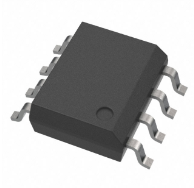 | - Simple layout     | - More efficient for brushed motors |
| TB67H451FNG,EL $1.50 | - Cheap | - Half bridge drivers |
| [Link](https://www.digikey.com/en/products/detail/toshiba-semiconductor-and-storage/TB67H451FNG-EL/11568781) |  |  |
--------------
Choice: Option 1
-
Rationale: IFX9201SGAUMA1 features some useful safety and utility specifications while still being at a very competitive price. Features such as the short circuit shutdown, allowing for more electrical safety for the device, high reliability, and low standby current for power conservation can be very useful. Additionally the product uses SPI communication to meet the requirements of the project.

--------------------
## Temperature Sensor

| Option 1 | Pros          | Cons          |
| -------- | ------------- | ------------- |
| 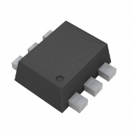 | - Programmable switch that operates when temperature passes a certain value makes it easy to choose a threshold heat value | - Needs E-96 series standard decade value resistors to program |
| TMP392A2DRLR $1.16 | - Advertised as ultra low power consumption |  |
| [Link](https://www.digikey.com/en/products/detail/texas-instruments/TMP392A2DRLR/11308866) |  |  |

| Option 2 | Pros          | Cons          |
| -------- | ------------- | ------------- |
| 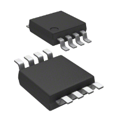 | - Surface mount | - Only 1 wire communication |
| DS18B20U+ $6.79 | - addition pins for digital outputs | - only digital |
| [Link](https://www.digikey.com/en/products/detail/analog-devices-inc-maxim-integrated/DS18B20U/1017603) | - set boundaries so it doesn't crash under intense heat | - more expensive |

| Option 3 | Pros          | Cons          |
| -------- | ------------- | ------------- |
| 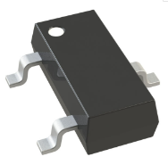 | - Utilizes only 3 pads to conserve PCB space | - Analog only. Useful for this project, but lesser product overall if more data is needed or ADC is not used |
| MCP9700T-E/TT $0.30 | - Very cheap sensor | - Accuracy is not great at +/-2°C |
| [Link](https://www.digikey.com/en/products/detail/microchip-technology/MCP9700T-E-TT/1212510) |  |  |
--------------
Choice: Option 3
-
Rationale: The temperature sensor MCP9700T-E/TT can measure temperature from -40°C to +125°C with an accuracy of ±4°C. It has a low operating current of 6µA and a low supply voltage of 2.3V to 5.5V which is perfect for our project. The output voltage of the sensor is directly proportional to the measured temperature, with a slope of 10mV/°C and an offset of 500mV. This makes it easy to interface with analog-to-digital converters or microcontrollers. 

--------------
## Motor

| Option 1 | Pros          | Cons          |
| -------- | ------------- | ------------- |
| 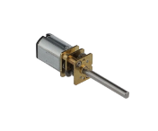 | - Gear system allows for good torque despite the small size | - Rated for 6V while most of our components are rated for a top range of 5-5.5V |
| COM0802 $8.50 |  |  |
| [Link](https://www.digikey.com/en/products/detail/dfrobot/FIT0578/9490123) |  |  |

| Option 2 | Pros          | Cons          |
| -------- | ------------- | ------------- |
| 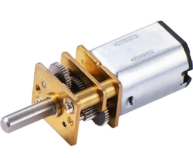 | - Easy to work with/easy communication | - Couldn't find on DigiKey |
| SKU:FIT048 7.99$ | - Part half of a team is working with in 455 |  |
| [Link](https://www.amazon.com/150RPM-Reduction-Gearbox-GA12-N20-Models/dp/B0BFQXFNTK/ref=asc_df_B0BFQXFNTK?tag=bingshoppinga-20&linkCode=df0&hvadid=80333201323909&hvnetw=o&hvqmt=e&hvbmt=be&hvdev=c&hvlocint=&hvlocphy=&hvtargid=pla-4583932720567818&th=1) | -  | -  |

| Option 3 | Pros          | Cons          |
| -------- | ------------- | ------------- |
| 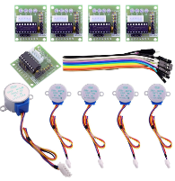 | - Easy to work with/easy communication | - Have to buy a pack of 5 |
| 28BYJ-48 ULN2003 5 pack: 14.99$ | - Part half of a team is working with in 455 | - Couldn’t find on DigiKey |
| [Link](https://www.amazon.com/ELEGOO-28BYJ-48-ULN2003-Stepper-Arduino/dp/B01CP18J4A/ref=asc_df_B01CP18J4A?tag=bingshoppinga-20&linkCode=df0&hvadid=79852084167122&hvnetw=o&hvqmt=e&hvbmt=be&hvdev=c&hvlocint=&hvlocphy=&hvtargid=pla-4583451663270158&psc=1) | - Great explanation online with a lot of helpful tips |  |
--------------
Choice: Option 2
-
Rationale: This motor is most ideal for our project because it has a full metal gearbox that provides high torque and durability. It also has a low noise level and a long service life which is needed for being close to ears. The 3mm shaft is great and also its ability to move smoothly and accurately.

--------------
## OpAmp

| Option 1 | Pros          | Cons          |
| -------- | ------------- | ------------- |
| 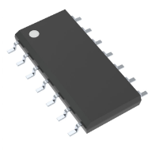 | - Inexpensive and simple use | - High current output |
| LM324DR $0.37 | - Supply voltage 1.5V to 16V |  |
| [Link](https://www.digikey.com/en/products/detail/texas-instruments/LM324DR/555719) |  |  |

| Option 2 | Pros          | Cons          |
| -------- | ------------- | ------------- |
|  | - Easy to work with  | - 1.2MHz current |
| TLV8802DGKT 1.22$ | - Operates with 0.7V - 5.5V  |  |
| [Link](https://www.digikey.com/en/products/detail/texas-instruments/TLV8802DGKT/6204638) |    |  |

| Option 3 | Pros          | Cons          |
| -------- | ------------- | ------------- |
| 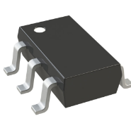 | - Operates from 2.7V to 36V as well as 1.35V to 18V | - 6MHz current |
| TSB511ILT 1.21$ | - Size |  |
| [Link](https://www.digikey.com/en/products/detail/stmicroelectronics/TSB511ILT/16818509) |  |  |
-------------
Choice: Option 1 
-
Rationale: The LM324DR has a very competitive price along with simple usage that will allow us to build the project quickly and efficiently. The simple design of the product also allows for easy testing and debugging in the design as well. Finally, the LM324DR has the ability to amplify up to 4 different signals, allowing us to reduce the amounts of components needed to amplify all of our light sensor signal outputs.
