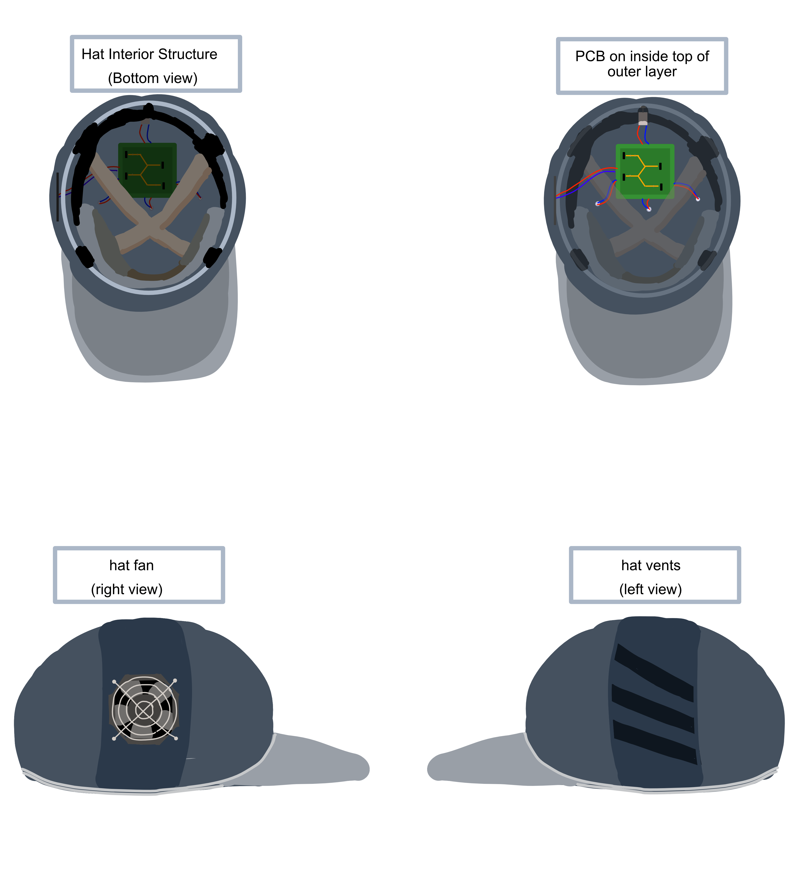

# Design Selection

Our team is developing an innovative hat equipped with an integrated temperature and light sensor to monitor the internal conditions in real-time. This smart hat is designed to provide optimal comfort and protection against varying environmental conditions. The embedded sensors diligently track the temperature and light exposure, ensuring the wearer remains well-informed about the internal ambiance. In instances where the temperature rises beyond a comfortable threshold, an in-built fan activates automatically to cool down the interior, providing a refreshing and comfortable experience for the wearer. This fusion of fashion and technology not only enhances comfort but also adapts to varying environmental conditions, making it a practical choice for outdoor enthusiasts and individuals spending considerable time outdoors.

[Home Page](index.md)
