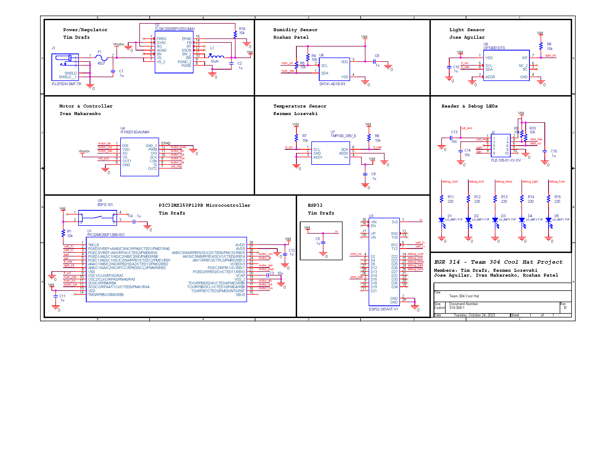

# Final Hardware Implementation

## Schematic 

Our hardware design utalizes the PIC3232MX250F128B to control and collect data from all of our components. The three sensors are connected using I2C while the motor controller uses SPI to communicate with the PIC. To accomodate for pin availability, we connected the light sensor and temperature sensor on the same I2C pins and will uses different signal addresses to distinguish information from the two. 

## PCB

An overview of our finalized PCB. This is the only image available due to export license issues in Cadence. Two images of the final printed version below.

An image of the final hardware all put together. Unfortunatly, our surface mount pic32mx250f128b was shorted from the vdd ling to gnd. Becuase of this, we connected a spare through hole pic to a perfboard and placed wire connections to each of the pic surface mount pads to connect the pic. 

## Bill of Materials

For our surface mount resistors and capacitors we are using 1206 components. These components are small, but still large enough to be manipulated by hand. We ensured to buy more components than necassary to account for broken or lost components, especially with the 1206 pieces which can be easily lost due to their small size. 

[Home Page](index.md)
