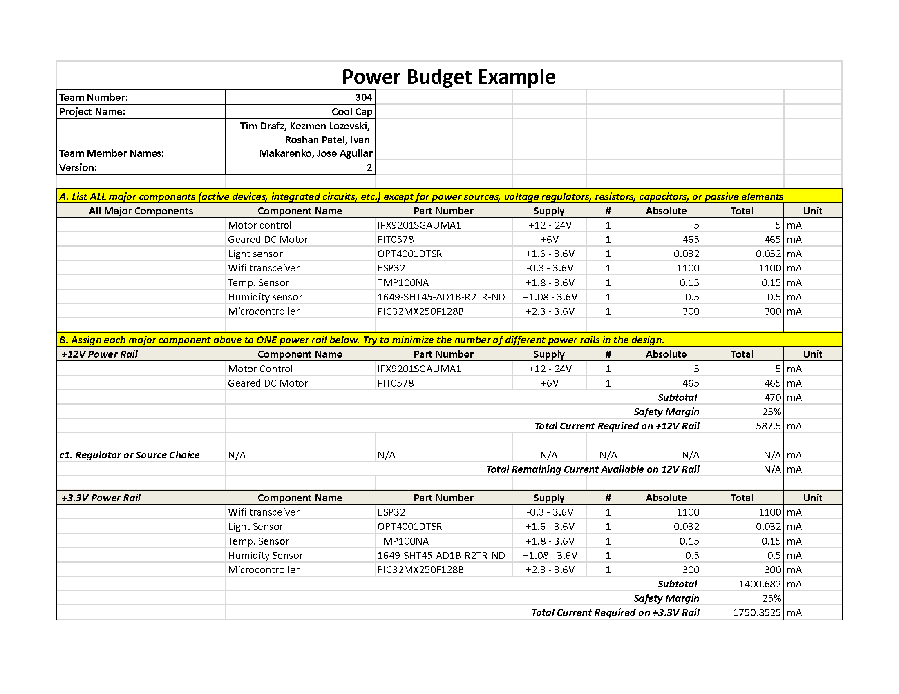

# Power Budget

- Our team has meticulously engineered the project to ensure the power budget remains within the designated limit, promoting both efficiency and reliability. The primary power source utilized by our components is 3.3V, which has proven to be sufficient for the majority of our operational needs, with the exception of the motor that requires an additional power source of 6V.

[Home Page](index.md)
