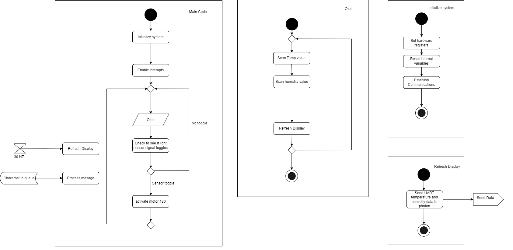

# Final Software Implementation
------------------

 For our software proposal, the first major action is an interupt that controls the oled display. First, the humidity and temperature values are recieved by their cooresponding sensors. Next, the data is transfered to the ESP32 to be broadcasted through wifi. The next important section of the code deals with the light sensor and the actuator. The light is sensed through the lightsensor which is on one side of the hat. If the light value is high enough, the the motor will spin the brim to that side of the hat. If the sensore is not high enough, the sensor will resort to the otherhalf of the hat. Ideally the back side of the hat should have the sensor so that the resorted point is the front side of the hat.
