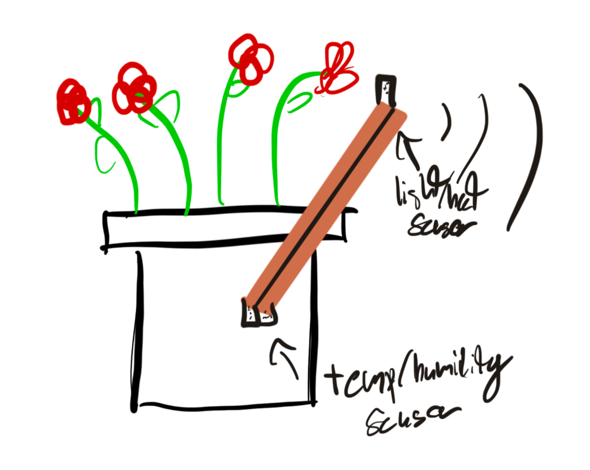
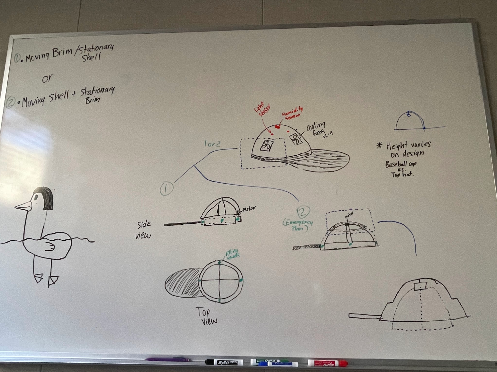

# Cool Cap Project

## Ideation Concepts
After our brainstorming session, our team set out to create some different project concepts. Putting together the brainstormed ideas into more cohesive product ideas, our team came up with three designs. 

### Concept 1: Humidity/Light Flower Helper

Description of Concept 1:  
- Detects humidity and temperature of dirt.
- Also detects sunlight and heat
- Sends signal to owner's phone to let them know if the water levels are low or if its not getting enough sun

---

### Concept 2: Solar Panel Cleaner

Description of Concept 2:  
- Detects dirt and other particles on solar panel.
- Also detects excessive heat buildup on the panels.
- If the panels get too hot or dirty the device uses a water spray and wiper blade like arms to clean and, or cool the solar panels.

---

### Concept 3: Cool Hat

Description of Concept 3:  
- Utalises multiple light sensors to sense the direction of the sun during the day.
- The hat brim can rotate to shade the user in the direction of the sunlight. 
- Humidity sensors also sense when the temperature is high humidity as well as hot.
- Built in fans in the hat will cool the user under the hat. *Note, the hat has too seperate layers allowing for an air flow to blowunder the top layer directly on the user.

All three designs held promise. In the end, our team chose to do the cool hat idea becuase it seemed like the project that could generate the most interesting final product and the one that would be the most rewarding and enjoyable to pull off. 
