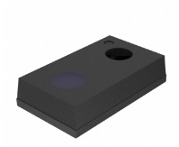
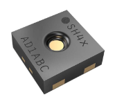
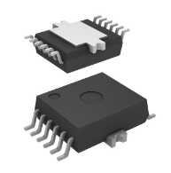
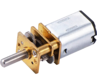
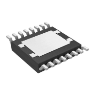
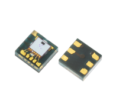
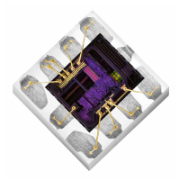
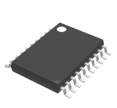

# Cool Hat Project

## Team 304

## Team Members
- **Kezmen Lozevski**
- **Tim Drafz**
- **Jose Aguilar**
- **Ivan Makarenko**
- **Roshan Patel**

## Preparation Date: 12/3/2023

## ASU, EGR 314, Kevin Nichols

---

## Table of Contents

- [Introduction](#)
- [Mission Statement](#Mission-Statement)
- [Team Charter](#Team-Charter)
- [Team Organization](#Team-Organization)
- [User Needs and Benchmarking](#User-Needs-and-Benchmarking)
- [Design Ideations](#Design-Ideations)
- [Design Selection](#Design-Selection)
- [Block Diagram](#Block-Diagram)
- [Component Selection](#Component-Selection)
- [Power Budget](#Power-Budget)
- [Microcontroller Selection](#Microcontroller-Selection)
- [Hardware Proposal](#Hardware-Proposal)
- [Software Proposal](#Software-Proposal)
- [Lessons Learned](#Lessons-Learned)
- [Appendix](#Appendix)

---

## Introduction
Our team was tasked with creating a device that uses multiple serial communication sensors and an actuator to respond to it's environment and complete a task. The device should also feature wifi connectivity to broadcast data through an MQTT protocal. Furthermore, due to the size of the group involved there needs to be a total of four subsystems involved in the final product.

The purposes of this report are to showcase the finalized ideas, iterations, and implementations of our group project to create an embedded system that could rotate a hat when sensing light from a certain direction. The hat would also utilize fans to help cool the user wearing it when specific temperature and/or humidity thresholds were reached. While working on the project the scope required for all of this needed to be brought down. Eventually the idea of light from multiple directions became too complicated and required too many individual sensors. This was reduced down to one and would move the hat to one of two locations based on how much light it detected. The fans were also removed during the process due to cost limitations. Ultimately, there were various issues that happened which prevented a fully-functioning prototype, but the lessons learned from it  all made for good experience for the future.

When going through this report please feel free to click the hyperlinks embedded into some of the headlines for more detailed information. The following are shortened for ease of use.

---

## Mission Statement
When starting this project, our team came up with a simple and concise mission statement.

__Our goal is to create a device that utalizes multiple unique sensors to take input from its environment 
to perform a meaningful or beneficial task.__

---
## Team Charter
Our group set out to consider what benefits we hoped to find through the creation of a succesful project.  we thought of how a succesful design and implementation could benefit us personally, more then just the scope of the class. This would be the foundation of our team charter, a set of common goals for our team to allign with and strive for. 
- Gain more insight into creating electronic systems utilizing industry-level software such as Orcad Cadence, and MPlab.
- Gaining more experience in the design and construction of different serial sensing and actuation circuits.
- Demonstrating a neat project to friends and family.
- Expanding our project resume with an interesting design that conveys what we learned throughout the course.
- Gaining more confidence and familiarity with electrical systems, in general, to give us a higher repertoire of skills when handling future electrical system tasks.

---

## [Team Organization](team-organization.md)
Team communication and synergy, as well as a consistant working schedual are vital components to creating a succesful project. To ensure we could acheive these provisions we set out to find what times we could all meet up to schedual meetings, and established our main modes of team communication. 

---

## [User Needs and Benchmarking](user-needs-benchmarking.md)
After our design ideation and choosing an idea concept we were happy with, we set out to benchmark similar ideas that were out in the market, as well as to observe the complaints and positive feedback these ideas received. This was useful, as it gave us insight into what worked well and was well received, as well as giving us foresight on what could go wrong with our design and mistakes to avoid in our product design.

---

## [Design Ideations](design-ideation.md)
After our insightful brainstorming session, our team embarked on a journey to amalgamate our collective ideas and channel them into innovative project concepts. We meticulously synthesized the various suggestions and insights from the brainstorming, resulting in the formulation of three distinct and cohesive product designs. Each design reflects our team's commitment to innovation and our aim to meet the envisioned objectives.

----

## [PIC Code](pic.md)
A link to the final MPLAB X code created for the project. Includes images from MPLAB X MCC Harmony. The below image shows the pin layout used minus two pins. Pins 4/5 (RB0/1) are shown as unassigned, but they are left as the default PGD and PGC lines for programming. Harmony does not allow you to assign programming/debug to any pins; only overwrite them as the defaults.

----

## [ESP32 Code](esp32.md)

-------------

## [Design Selection](Design-Selection.md)
Our team is designing a smart hat with temperature and light sensors to monitor its internal environment. If the temperature goes beyond a set limit, an integrated fan turns on for cooling. The hat's brim also rotates to shield the wearer from direct sunlight, regardless of the sun's position. This tech-infused hat ensures optimal comfort and adaptability for outdoor activities.

----

## [Block Diagram](Block-Diagram.md)

The block diagram explains how the PCB will function with all the components at a hardware scale. The diagram explains that the board will be supplied with 12V, but the regulator reduces it to 3.3V for operation. The light, temperature, and humidity sensors will communicate through I2C (two components will be using the same I2C pin for communication without interference), while the motor driver runs on SPI. The user can see the data through an OLED Display and through a device via WiFi on the ESP32 module. 

---

## [Component Selection](Component-Selection.md)

Once we had a good idea of what we had in mind for our project design, we set out to choose the components that would allow us to build our vision. To do so, we listed out the major components that would be needed including the voltage regulator, UV light sensor, humidity sensor, motor driver, temperature sensor, and the motor. To better ensure we had a good selection of each component, we set out to find at least three candidates for each component. This would allow us to compare different choices and component properties to find what best fits our needs, rather than choosing a component and trying to fit our project around it. 

| Component           | Image                                                        | Positive Aspects |
|---------------------|--------------------------------------------------------------|------------------|
| Voltage Regulator   |                          | - Higher voltage ceiling that can be stepped down. - Good switching frequency range using both Khz and Mhz ranges. Better on/off control. |
| UV Light Sensor     |                            | - Has multifunctionality and is programmable for easier use. - Low power necessities. - Works with our programs we want to use for our system. |
| Humidity Sensor     |                            | - Simple to understand. - Only one output pin. - Given PCB build. |
| Motor Driver        |                               | - Logic inputs 3.3 V and 5.0 V TTL/CMOS-compatible. - Chopper current limitation. - Short circuit shut down with latch behavior. - Over Temperature shut down with latch behavior. - VS undervoltage shutdown. - Open load detection in ON and OFF state. |
| Temperature Sensor  |                         | - Utilizes only 3 pads to conserve PCB space. |
| Motor               |                                       | - Easy to work with/easy communication. - Part half of a team is working with in 455. |

---

## [Power Budget](Power-Budget.md)

The power budget is an important detail in the design process. It is designed to help calculate the needed voltages and current to keep all components running with the risk of shorting anything from over-voltage or current. In this case, the three sensors being used in our PCB will use 3.3V from a 12V power source. It mentions our use of the regulator that will allow for the safe operation of the peripherals. The motor Driver will use a higher voltage which will be considered when designing the final PCB.

---

## [Microcontroller Selection](Microcontroller-Selection.md)
Similarly to the component selection, our team set out to find multiple microcontroller candidates. This would promote flexibility and consideration in our design. By comparing and contrasting each microcontroller's attributes, we could better identify which microcontroller best fits the needs and specifications of our project design.

 
After considering our choices, we went for the PIC32MX250F128B. 

---

## [Hardware Proposal](Hardware-Proposal.md)
Once our components and microcontrollers had been selected, we needed to put them all together. First, each team member created a design for an individual subsystem. These subsystems consisted of the motor controller, the power regulator, and the light, temperature, and humidity sensors. From there, all the subsystems needed to be put together into a single schematic. Some of the issues that arose were figuring out how to connect all the components to the single microcontroller. One solution to use fewer pins was to connect the light sensor and temperature sensor to the same I2C pins and use different addresses as a way to separate their communications. Finishing the hardware proposal was an important milestone in creating our final product, as it creates the blueprint for the physical PCB and component connections. 

---

## [Software Proposal](Software-Proposal.md)
Once we have decided all of the physical components of our design and have a good idea of how they fit together, we were ready to start thinking of how they work together. While we still didn't have physical hardware to code yet, a software proposal is useful for envisioning how all the components being designed would work together logically. Additionally, a good software proposal is a good foundation for the code when it is time to start developing it. 

---

## Lessons Learned
 One of the biggest lessons learned was to give more investigation into the microcontroller selection. While the PIC32 that we chose had many advantages for use in what we wanted to do, it had the downside of using MPLAB Harmony only. This added additional learning, and the code used in MCC on other PICs did not actually work for this. Along with this the PIC32 we had was internally shorted on the Vdd pin to Vss. We should have had each member order samples from Microchip, but only had one. When this one failed we only had a DIP version to fall back on. To add onto the need to investigate more, it would have been better to go with a PIC that had more pins. We had a couple extra, but the amount needed by the motor controller we chose ended up increasing what was used. This made the OLED pins move to the ESP32 and complicated actual pin selection for the final design as some pins could not be changed. A 40 pin PIC would have probably been ideal for ease.
 Another lesson learned is to pay close attention to the size of the components purchased, particularly the size and spacing of the pins. It is hard to picture how small components really are with just measurements and pictures of the device, or how thin traces need to be until the PCB board is printed out. Sensors can get very small very easily and many are not designed to be soldered by hand. This can create a big issue particulary for testing the individual component testing and debugging, where more time may be in trying to ensure connections of tiny pins to thin traces than actually debugging and testing. 
 For final demonstration the voltage regulator would not output any desired voltage, and the most likely culprit for this was a miscalculation for the input/output loads based on our design. Additional inductors or capacitors on the input line may have been required due to the line being split going into the regulator and the motor controller directly. To note during troubleshooting, a bypass capacitor on both the input/output were changed to 10uF to induce more and this did not resolve the issue. For this reason we felt that we may have needed to calculate using more inductors as the signal was probably too rough for the regulator to work.
## Appendix

## [Presentation 1](presentation-1.md)

## Component Selection

| Voltage Regulator | Pros          | Cons          |
| -------- | ------------- | ------------- |
|  | - Relatively cheap compared to other 3.3V regulators.    | - Maximum Vin is 6V (5.5V recommended); the input of our power budget. No extra room.     |
| SC189ZSKTRT - IC REG BUCK 3.3V 1.5A $1.20/ea Link | - Small footprint on PCB so it is easier to fit with other components into smaller space.     | - Adjustable output voltage only goes from 1 to 3.3V so most of the range does not work for this project.  |
| [Link](https://www.digikey.com/en/products/detail/semtech-corporation/SC189ZSKTRT/2182360) | - Small footprint on PCB so it is easier to fit with other components into smaller space.     |    |

| Voltage Regulator | Pros          | Cons          |
| -------- | ------------- | ------------- |
|  | - Output voltage is adjustable from 3.3V to 20V in case the power rail needs editing later on.     | - Output current is limited to 500mA maximum with a 380mA recommended.    |
| LT3433EFE#TRPBF - IC REG BCK BST ADJ 500MA $9.54/ea | - Capable of both stepping-up and stepping-down the input voltage.     | - Far more expensive than most other 3.3V capable regulators.    |
| [Link](https://www.digikey.com/en/products/detail/analog-devices-inc/LT3433EFE-TRPBF/959580) |       |        |

| UV Light Sensor | Pros          | Cons          |
| -------- | ------------- | ------------- |
|  | - Senses specifically UV light, eliminating the chances of other light waves interfering with the signal.      | - A 2mm x 2mm dimension will make it harder to install and make sure its working   |
| LTR-390UV-01 $0.62 | - Great price for our project.      | - Will make the piece hard to attach properly.    |
| [Link](https://www.digikey.com/en/products/detail/liteon/LTR-390UV-01/7322497) |     |      |

| UV Light Sensor | Pros          | Cons          |
| -------- | ------------- | ------------- |
|  | - Surface mount which is necessary for our system design   | - Component takes a higher understanding of light sensors     |
| SI1132-A10-GM-ND $3.61 | - Mainly used for UV light which is what we want for our system     | - A 2mmx2mm dimension makes it harder for us to install and make sure it works properly     |
| [Link](https://www.digikey.com/en/products/detail/silicon-labs/SI1132-A10-GM/6195840) | - Given PCB outline makes it easier to understand how to install and get running    | -Also reads ambient light so that could effect our UV light readings    |

| Humidity Sensor | Pros          | Cons          |
| -------- | ------------- | ------------- |
|  | - Very well documented data sheet      | - More expensive. Considering we will need to by multiple in case some get lost or damaged due to their small size     |
| HDC3022DEJR $5.61 | - Will be easy to find all necessary specifications     | - It could limit our budget    |
| [Link](https://www.digikey.com/en/products/detail/texas-instruments/HDC3022DEJR/17748469) |      |      |

| Humidity Sensor | Pros          | Cons          |
| -------- | ------------- | ------------- |
|  | - Cheaper than usual     | - A 2mmx2mm dimension makes it harder for us to install and make sure it works properly     |
| 1649-SHTC3-TR-10KSTR-ND $2.86 | - Surface mountable     | - Difficult to surface mount because of size of pins |
| [Link](https://www.digikey.com/en/products/detail/sensirion-ag/SHTC3-TR-10KS/9477851) | -  Can be used as both a temperature and  humidity sensor |    |

| Motor Driver | Pros          | Cons          |
| -------- | ------------- | ------------- |
|  | - Abnormality Detection Signal Output contributing to high reliability | - Expensive |
| BD16912EFV-CE2 $6.30 | - Low ON resistance and small package, |  |
| [Link](https://www.digikey.com/en/products/detail/rohm-semiconductor/BD16912EFV-CE2/10495192) | - Low power consumption and space saving of the set  |  |

| Motor Driver | Pros          | Cons          |
| -------- | ------------- | ------------- |
|  | - Simple layout     | - More efficient for brushed motors |
| TB67H451FNG,EL $1.50 | - Cheap | - Half bridge drivers |
| [Link](https://www.digikey.com/en/products/detail/toshiba-semiconductor-and-storage/TB67H451FNG-EL/11568781) |  |  |

| Temperature Sensor | Pros          | Cons          |
| -------- | ------------- | ------------- |
|  | - Programmable switch that operates when temperature passes a certain value makes it easy to choose a threshold heat value | - Needs E-96 series standard decade value resistors to program |
| TMP392A2DRLR $1.16 | - Advertised as ultra low power consumption |  |
| [Link](https://www.digikey.com/en/products/detail/texas-instruments/TMP392A2DRLR/11308866) |  |  |

| Temperature Sensor | Pros          | Cons          |
| -------- | ------------- | ------------- |
|  | - Surface mount | - Only 1 wire communication |
| DS18B20U+ $6.79 | - addition pins for digital outputs | - only digital |
| [Link](https://www.digikey.com/en/products/detail/analog-devices-inc-maxim-integrated/DS18B20U/1017603) | - set boundaries so it doesn't crash under intense heat | - more expensive |

| Motor | Pros          | Cons          |
| -------- | ------------- | ------------- |
|  | - Easy to work with/easy communication | - Have to buy a pack of 5 |
| 28BYJ-48 ULN2003 5 pack: 14.99$ | - Part half of a team is working with in 455 | - Couldn’t find on DigiKey |
| [Link](https://www.amazon.com/ELEGOO-28BYJ-48-ULN2003-Stepper-Arduino/dp/B01CP18J4A/ref=asc_df_B01CP18J4A?tag=bingshoppinga-20&linkCode=df0&hvadid=79852084167122&hvnetw=o&hvqmt=e&hvbmt=be&hvdev=c&hvlocint=&hvlocphy=&hvtargid=pla-4583451663270158&psc=1) | - Great explanation online with a lot of helpful tips |  |

| Motor | Pros          | Cons          |
| -------- | ------------- | ------------- |
|  | - Gear system allows for good torque despite the small size | - Rated for 6V while most of our components are rated for a top range of 5-5.5V |
| COM0802 $8.50 |  |  |
| [Link](https://www.digikey.com/en/products/detail/dfrobot/FIT0578/9490123) |  |  |

