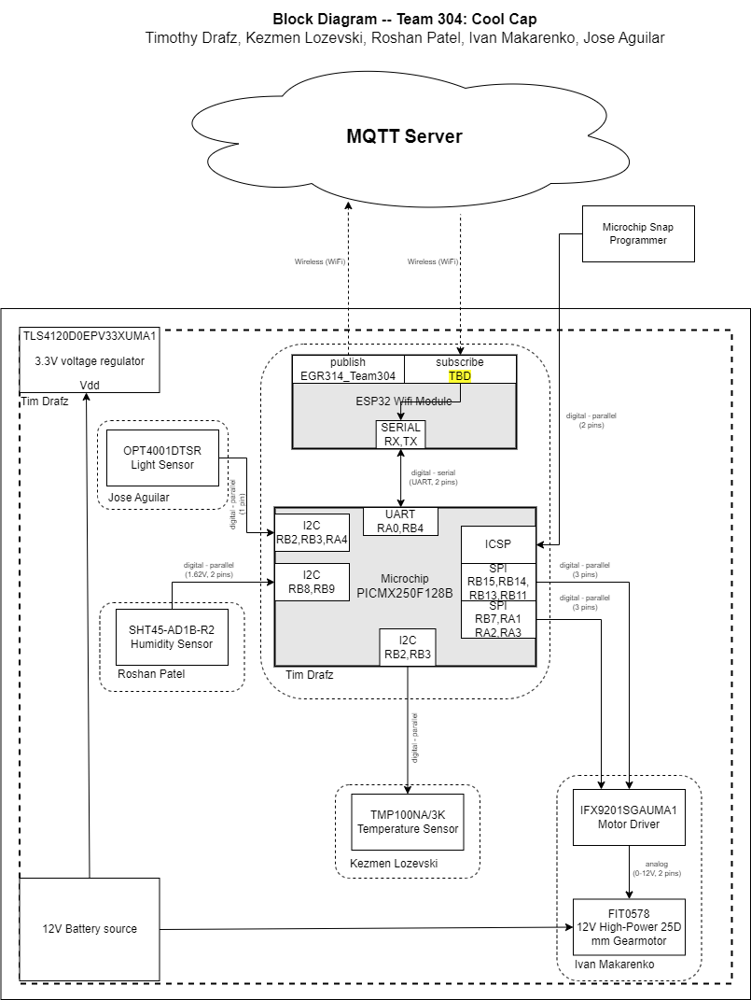

# Cool Hat Project

## Team 304

## Team Members
- **Kezmen Lozevski**
- **Tim Drafz**
- **Jose Aguilar**
- **Ivan Makarenko**
- **Roshan Patel**

## Preparation Date: 10/16/2023

## ASU, EGR 314, Kevin Nichols

-------------
# Team Charter
To give us a sense of motivation and goals to strive for, our team set out to create a charter of the things we wanted to gain through the completion of this project. Rather than  "just passing the class" this charter was aimed at the satisfaction or benefits a successful project would give us beyond the scope of the class. 
- Gain more insight into creating electronic systems utilizing industry-level software such as Orcad Cadence, and MPlab.
- Gaining more experience in the design and construction of different serial sensing and actuation circuits.
- Demonstrating a neat project to friends and family.
- Expanding our project resume with an interesting design that conveys what we learned throughout the course.
- Gaining more confidence and familiarity with electrical systems, in general, to give us a higher repertoire of skills when handling future electrical system tasks.

---

# Mission Statement
Along with the charter, a simple but concise mission statement gave us a clear target to follow while creating the project. 

__To create a device that uses multiple unique sensors to take input from its environment and perform a meaningful or beneficial task. Our goal is to enhance everyday
life by making technology both adaptive and user-friendly. We are committed to responsible design that considers both practicality and sustainability.__

---

# Checkpoint 1
## [Team Organization](team-organization.md)

---

## [User Needs and Benchmarking](user-needs-benchmarking.md)
After our design ideation and choosing an idea concept we were happy with, we set out to benchmark similar ideas that were out in the market, as well as to observe the complaints and positive feedback these ideas received. This was useful, as it gave us insight into what worked well and was well received, as well as giving us foresight on what could go wrong with our design and mistakes to avoid in our product design.

---

## [Design Ideations](design-ideation.md)
After our insightful brainstorming session, our team embarked on a journey to amalgamate our collective ideas and channel them into innovative project concepts. We meticulously synthesized the various suggestions and insights from the brainstorming, resulting in the formulation of three distinct and cohesive product designs. Each design reflects our team's commitment to innovation and our aim to meet the envisioned objectives.

----

## [Presentation 1](presentation-1.md)

----

## [Team Checkpoint](checkpoint-1.md)

----

## [PIC Code](pic.md)

----

## [ESP32 Code](esp32.md)

-------------
# Checkpoint 2

## [Design Selection](Design-Selection.md)
Our team is designing a smart hat with temperature and light sensors to monitor its internal environment. If the temperature goes beyond a set limit, an integrated fan turns on for cooling. The hat's brim also rotates to shield the wearer from direct sunlight, regardless of the sun's position. This tech-infused hat ensures optimal comfort and adaptability for outdoor activities.

----

## [Block Diagram](Block-Diagram.md)
Summary for block diagram

---

## [Component Selection](Component-Selection.md)
Summary for component selection

---

## [Power Budget](Power-Budget.md)
summary

---

## [Microcontroller Selection](Microcontroller-Selection.md)
summary

---

## [Hardware Proposal](Hardware-Proposal.md)
summary

---

## [Software Proposal](Software-Proposal.md)
summary
